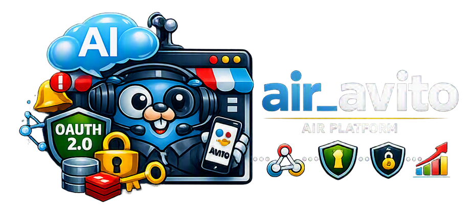

# AiR Avito



[🇷🇺 Russian version](README.ru.md)


[](https://t.me/marusia_dev)

An AiR platform microservice for connecting Avito Messenger to an AI assistant. The service authorizes users in Avito, receives messages through a webhook, passes them to the shared AiR pipeline, and sends responses back to Avito.

## User Data Protection

All user data is encrypted with an individual `MasterKey`. This key is available only through the user's password and encrypts the Avito authorization API token, dialog history, and individual bot settings. These data can be decrypted only after the user is authenticated in the system with their individual password. Even if the database is compromised or leaked, user data remains unavailable both to attackers and to the service administration.

## Features

- OAuth 2.0 authorization in Avito and token storage;
- starting and stopping personal Avito clients;
- retrieving chat lists and webhook subscriptions;
- subscribing and unsubscribing to Avito webhooks;
- receiving Avito Messenger events;
- passing messages to the AI router and processing assistant responses;
- integration with CRM and operator mode;
- restoring user clients after service startup;
- Prometheus metrics and graceful shutdown.

## Architecture

```text
Avito Messenger
       |
       | OAuth / REST / webhook
       v
  air_avito (Fiber :8080)
       |            |             |
       v            v             v
     MySQL        Redis       air_orchestrator
                                  (gRPC)
       |
       +--> AI models / CRM / AiR operator pipeline
```

`air_avito` is an HTTP integration service for Avito. Configuration and user master keys are requested through the gRPC client of the shared AiR Orchestrator service. User data and OAuth tokens are stored in MySQL; Redis is used for temporary first-interaction state and is optional — if it is unavailable, the service continues working with limited recovery functionality for this state.

## HTTP API

The HTTP server listens on port `8080`.

```text
GET  /metrics

GET  /v1/avito/status?uid={uid}
POST /v1/avito/auth/url?uid={uid}
GET  /v1/avito/enable?uid={uid}
GET  /v1/avito/disable?uid={uid}
GET  /v1/avito/chats?uid={uid}&limit={limit}&offset={offset}&unread_only={bool}
GET  /v1/avito/subscriptions?uid={uid}
POST /v1/avito/subscribe?uid={uid}
POST /v1/avito/unsubscribe?uid={uid}&url={webhook_url}

GET  /open/avito/available
GET  /open/avito/auth/callback?code={code}&state={state}
POST /open/avito/webhook
```

The `/v1/avito/auth/url` request accepts the following JSON body:

```json
{
  "url": "example.com",
  "client_id": "avito-client-id",
  "client_secret": "avito-client-secret"
}
```

The public `/open/avito/*` routes are used by Avito for availability checks, the OAuth callback, and webhooks. The `/v1/avito/*` routes require the `uid` query parameter.

The complete API description is available in [`doc/openapi.yaml`](doc/openapi.yaml).

## Technologies

- Go 1.25.8;
- Fiber v3 — HTTP server and routing;
- MySQL — persistent storage and Avito tokens;
- Redis — temporary first-interaction cache;
- gRPC — communication with `air_orchestrator`;
- OAuth 2.0 and the Avito Messenger REST API;
- Prometheus — metrics;
- Docker / Docker Compose — running and deployment;
- Loki — container log collection;
- OpenAI, Google, and Mistral — AI model routers through `air-common`.

## Running

Development uses [`dev.yml`](dev.yml):

```bash
docker compose -f dev.yml up --build
```

The production configuration is located in [`prod.yml`](prod.yml):

```bash
docker compose -f prod.yml up -d
```

The service connects to the external Docker networks `air_shared` and `monitoring_shared`. MySQL and Redis must be available in the network under the names `air_db` and `air_redis`, and the configuration gRPC service must be available at `airorc:50051`.

## Configuration

Main environment variables:

```text
DB_HOST=air_db:3306
DB_NAME=air
DB_USER
DB_PASSWORD
REDIS_ADDR=air_redis:6379
REDIS_PASSWORD
REDIS_DB=0
GRPC_CONFIG_HOST=airorc:50051
SERVICE_KEY_FILE=/run/secrets/service_key
REAL_URL
LOG_LEVEL=info
GLOB_USER_MODEL_TTL=1440
```

`SERVICE_KEY_FILE` points to the mounted read-only service key file. The public address for the OAuth redirect URI is set through `REAL_URL` (`DOMAIN` is substituted into `prod.yml` in production).

## Related Services

- [air-common](https://github.com/ikermy/air-common) — common library for AI microservices;
- [air_orchestrator](https://github.com/ikermy/air_orchestrator) — main orchestration service;
- [air_operator](https://github.com/ikermy/air_operator) — service for forwarding user responses to operators, supporting all bot types;
- [marusia_crm](https://github.com/ikermy/marusia_crm) — service for integrating with external CRM systems;
- [air-logger](https://github.com/ikermy/air-logger) — event logging service with multi-user support and Loki collector integration.

## License

The project is distributed under the [MIT](LICENSE) license. It may be freely used, copied, modified, and distributed provided that the license text and copyright notice are retained.

The full license text is available in the [`LICENSE`](LICENSE) file.

## Contacts

[](https://t.me/ikermy)
